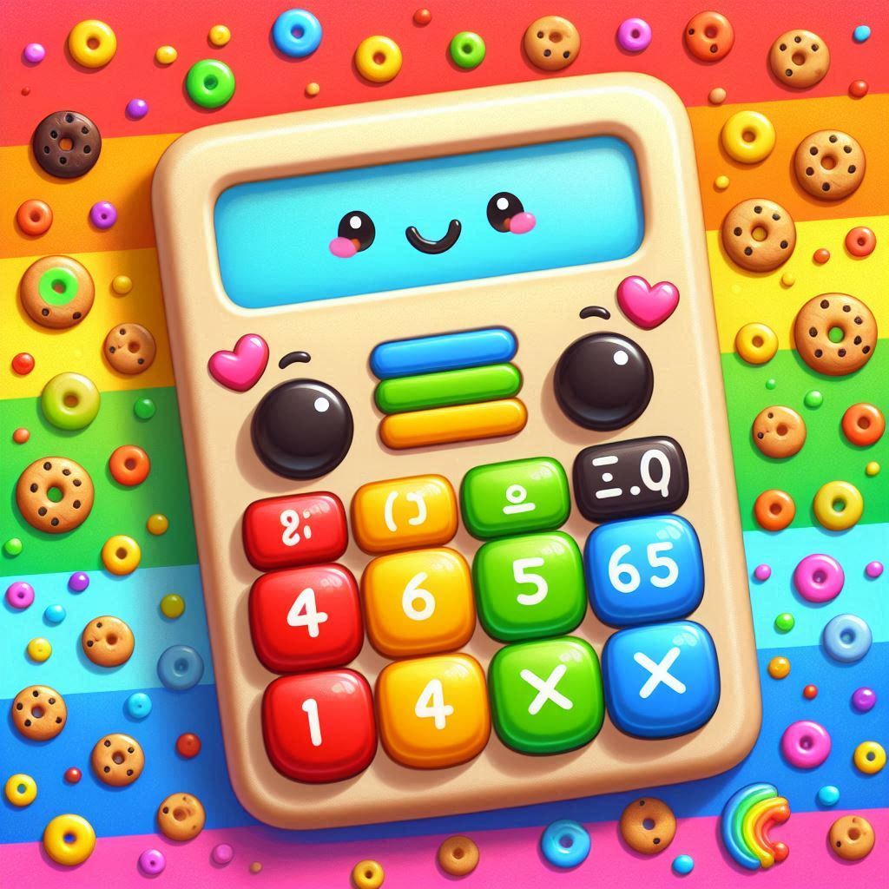

<h1>Calculator</h1>

Welcome to the Calculator App!

This app helps you to solve quick calculations. 

This is the C# Console Project #2

## Features

--**Advanced Calculations**: Solve difficult calculations such as square roots. 
--**Calculation Counter**: You can see how many times you've used the calculator.
--**Calculation Repeater**: You can choose an answer from the list of your latest calculation to do more calculations.

## Getting Started

### Prerequisites

- .NET 8 SDK installed on your system.

### Installation

#### Console

1. Clone the repository:
	- `git clone https://github.com/Jinboi/calculator.git`

2. Navigate to the project directory:
	- `cd src\Calculator`

3. Run the application using the .NET CLI:
	- `dotnet run`

### Console Screenshots

This is what your main menu looks like:

## Choose an option:
- **a**: For Addition
- **s**: For Subtraction
- **m**: For Multiplication
- **d**: For Division
- **p**: For Power
- **r**: For Square Roots
- **e**: For 10x
- **sin**: For Sine
- **cos**: For Cosine
- **tan**: For Tangent

Once you choose to play a Math Game, you will be able to choose your game difficulty:

## Choose an option:
- **Easy**: numbers between 1-9.
- **Normal**: numbers between 1-99.
- **Hard**: numbers between 1-999.

Then, you can set the number of questions you'd like to solve:

Keep in mind that there is a countdown before your game starts:

Also, you can see your score at the end of each game:

Finally, you can see your game history of previous games from View History:

## How It Works

- **Menu Navigation**: Use the provided options to select and configure your game.
- **Questions** Questions are generated according to your chosen operation and difficulty level.
- **Timer**: The timer begins when you start answering and stops when you finish.
- **History Recording**: After completing a game, your score and time are recorded in the history.

## Room for Improvements

- Data models and structures could have been designed better. 
- Too many methods have been used which can be factored out.
- GameEngine and GameLogic could've been seperated.

## Contributing

- Contributions are welcome! Please fork the repository and create a pull request with your changes. 
- For major changes, please open an issue first to discuss what you would like to change.

## License

- This project is licensed under the MIT License. See the [LICENSE](./LICENSE) file for details.

## Contact

- For any questions or feedback, please open an issue.

---
***Thank you and Happy Coding!***